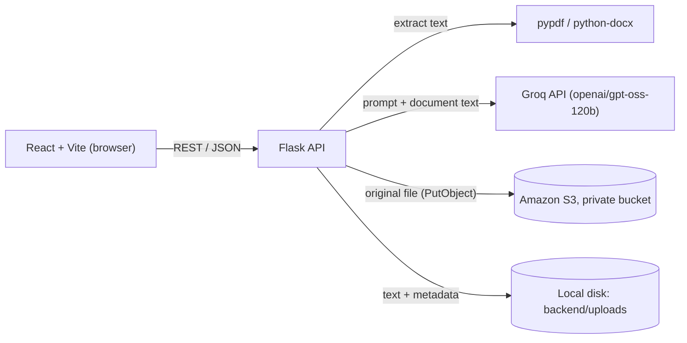

# ClauseClear

**Understand legal documents in plain English.**

ClauseClear is an AI-assisted tool that helps a non-lawyer read a rental agreement, employment contract, NDA or service agreement. Upload a PDF or DOCX and get a plain-language summary, the clauses worth a closer look, a checklist of action items and dates, and answers to questions that come **only from your document**.

> **ClauseClear is an information tool, not a lawyer.** It explains what a document says. It does not give legal advice and never tells you whether to sign. Its output can contain mistakes, so read the original document and consult a qualified lawyer for important decisions.

**Demo video:** TODO (add YouTube link)

## Features

| Tab | What it does |
|---|---|
| **Summary** | Plain-English overview, section-by-section explanation, key obligations and key dates. |
| **Risk Scanner** | Flags important clauses (auto-renewal, one-sided termination, penalties, indemnity, arbitration, confidentiality, and similar) as high / medium / low, each with the exact clause text and a neutral explanation. |
| **Q&A** | Ask questions about the uploaded document. Answers cite the clause and show the quoted text. If the document doesn't cover it, the reply is *"This document doesn't address that."* Requests for advice ("Should I sign?") get a fixed refusal. |
| **Checklist** | Action items, key dates, and neutral questions to consider asking a lawyer, each tied to a clause. |

## Architecture



1. The browser uploads a file to Flask, which validates it and extracts the text.
2. The original file is copied to a private S3 bucket. The extracted text stays on local disk.
3. Each feature (summary, risks, checklist, Q&A) is a separate function with its own prompt. Flask sends the document text to Groq and **validates the AI's JSON reply before returning it**.
4. The React app only ever talks to Flask. API keys never reach the browser.

## Tech stack

- **Frontend:** React, Vite, JavaScript, plain CSS
- **Backend:** Python, Flask, Flask-CORS, Flask-Limiter
- **AI:** Groq API, model `openai/gpt-oss-120b` (configurable via `GROQ_MODEL`)
- **Documents:** pypdf (PDF), python-docx (DOCX)
- **AWS:** Amazon S3, IAM, accessed with boto3

> **Model note:** the project was originally planned around Llama 3.3 70B. Groq retired that model for free and developer accounts on 16 August 2026, so the default is now `openai/gpt-oss-120b`. The model name is a setting, so it can be changed without touching code.

## How AWS is used

- **Amazon S3:** the original uploaded document is stored in a **private** bucket under `documents/<random id>/original.<ext>`. Block Public Access is on, and objects are uploaded with server-side encryption (SSE-S3, AES-256).
- **AWS IAM:** the app uses a dedicated IAM user with a customer-managed policy that allows only `s3:PutObject` on `documents/*` in that one bucket. It cannot read, list or delete. Credentials live only in the server's `.env` file.
- **boto3** is the AWS SDK used by the backend.
- If the AWS variables are not set, or an S3 upload fails, the app still works and simply doesn't show the "stored in S3" indicator.

## How the AI is kept grounded

These checks are implemented in code, not only in the prompts:

- **Risk excerpts** must appear in the document (whitespace, quotes and dashes normalised), or the item is dropped.
- **Checklist entries** need a supporting quote found in the document. **Dates** must appear in the document as written, so calculated or invented dates are dropped.
- **Q&A answers** are shown only with at least one verified quote from the document. Otherwise the reply becomes the fixed "doesn't address that" sentence.
- **Advice sentences** ("you should sign...") are stripped from the explanation text, and advice requests get a fixed refusal.
- **AI JSON is parsed and validated**, and incomplete replies become a friendly error.
- **The disclaimer** is fixed text added by the server, so the model cannot omit it.
- **Prompt-injection defences:** document text is wrapped as untrusted data, the prompts tell the model to ignore instructions inside it, and `samples/Injection_Test_Agreement.docx` is a deliberate test case.

**Not verified by code:** the wording of summaries, "why it matters" explanations and Q&A answers is written by the model. Quotes are checked, but the surrounding explanation can still be imperfect, and the risk scanner can miss clauses.

## Security measures implemented

- API keys and AWS credentials are read from environment variables (`backend/.env`, which is git-ignored). No secrets in the frontend or the repository.
- Uploads: PDF and DOCX only, checked by extension **and** file signature; 10 MB limit; user filenames are never used on disk (random IDs); strict document-ID validation; PDF page cap; DOCX zip-bomb guard.
- Rate limits per client (uploads and AI endpoints), returning a clear 429 message.
- CORS restricted to the local dev origins.
- Security headers on API responses, and JSON error messages that never include stack traces.
- The React app renders all document and AI text as plain text (no `dangerouslySetInnerHTML`).

## Known limitations and not implemented

Be aware of these before relying on ClauseClear:

- **No user accounts or authentication.** Anyone who can reach the server and knows a (random, 128-bit) document ID can query that document. Not suitable for a shared or public deployment as-is.
- **Local only.** It is not deployed, and there is no HTTPS locally. Uploaded files and extracted text are kept in `backend/uploads/` and are **not** automatically deleted.
- **Third-party processing.** Document text is sent to Groq to produce results. Don't upload documents you aren't comfortable sharing.
- **Document size:** text over about 16,000 characters (roughly 6 to 8 pages) is rejected because of free-tier token limits. This is configurable with `MAX_DOC_CHARS`.
- **No OCR:** scanned or image-only PDFs are not supported. Word's automatic list numbering is not extracted from DOCX files.
- **English only.** Free-tier rate limits can slow or interrupt AI calls.
- **Not implemented (future work):** multi-document library, retrieval/RAG and embeddings for long documents, Hindi and other Indian languages, contract comparison, PDF report export, Cognito authentication, DynamoDB, Lambda + API Gateway, public deployment.

## Setup (Windows PowerShell)

**Prerequisites:** Python 3.10+, Node 20+, Git, and a free [Groq API key](https://console.groq.com/keys). AWS is optional.

```powershell
git clone https://github.com/navneeta88/ClauseClear.git
cd ClauseClear

# Backend
cd backend
python -m venv venv
.\venv\Scripts\Activate.ps1
pip install -r requirements.txt
Copy-Item .env.example .env      # then open .env and add your keys
python app.py

# Frontend (in a second terminal, from the ClauseClear folder)
cd frontend
npm install
npm run dev
```

Open http://localhost:5173. After the first setup you can start both servers with `.\run-dev.ps1` from the repository root.

### Environment variables (`backend/.env`)

| Variable | Required | Purpose |
|---|---|---|
| `GROQ_API_KEY` | yes | Groq API key |
| `GROQ_MODEL` | no | Model name (default `openai/gpt-oss-120b`) |
| `AWS_ACCESS_KEY_ID`, `AWS_SECRET_ACCESS_KEY`, `AWS_REGION`, `S3_BUCKET_NAME` | no | Enable S3 storage (all four needed) |
| `MAX_DOC_CHARS` | no | Maximum document length in characters (default 16000) |
| `FLASK_DEBUG` | no | Defaults to `1` (auto-reload) for local work. Set `0` for anything beyond local use. |

## API

| Method | Endpoint | Body | Returns |
|---|---|---|---|
| GET | `/api/health` | - | Server status |
| POST | `/api/upload` | multipart `file` | Document metadata and `document_id` |
| POST | `/api/simplify` | `{document_id}` | Overview, sections, obligations, dates |
| POST | `/api/analyze-risks` | `{document_id}` | Risk items |
| POST | `/api/checklist` | `{document_id}` | Action items, key dates, lawyer questions |
| POST | `/api/chat` | `{document_id, question, history?}` | Answer with sources |

## Try it

The `samples/` folder has fictional documents for testing:

- `Sample_Rental_Agreement.pdf` and `.docx`: a rental agreement with a mix of routine and one-sided clauses. Try *"When does the tenancy end?"*, *"Are pets allowed?"* (not in the document) and *"Should I sign this?"*
- `Injection_Test_Agreement.docx`: contains a hostile instruction aimed at AI assistants, to check that it is treated as document text and not obeyed.

## Testing

Manually tested during development:

- Valid PDF and DOCX upload and text extraction
- Unsupported file type, empty file, and corrupted PDF/DOCX give friendly errors and no crash
- A wrong Groq API key produces a clear error message in the UI
- Rate limiting returns HTTP 429 after 10 requests per minute on an AI endpoint
- Q&A returns "This document doesn't address that." for topics the document doesn't cover
- The injection sample did not change the assistant's behaviour in our test
- Dependency audits (`pip-audit`, `npm audit`): TODO (write the actual result)

There are no automated unit tests yet.

## Project structure

```
ClauseClear/
├── backend/
│   ├── app.py                  # Flask API, validation, rate limits, error handling
│   ├── requirements.txt
│   ├── .env.example
│   └── services/
│       ├── document_parser.py  # PDF/DOCX text extraction
│       ├── groq_service.py     # AI calls + validation of AI output
│       ├── grounding.py        # checks quotes/dates against the document
│       ├── prompts.py          # all prompts
│       └── s3_service.py       # private S3 storage
├── frontend/                   # React + Vite app
├── samples/                    # fictional test documents
├── run-dev.ps1                 # starts both servers on Windows
└── README.md
```

Built for the WeMakeDevs x AWS **First Commit** hackathon.